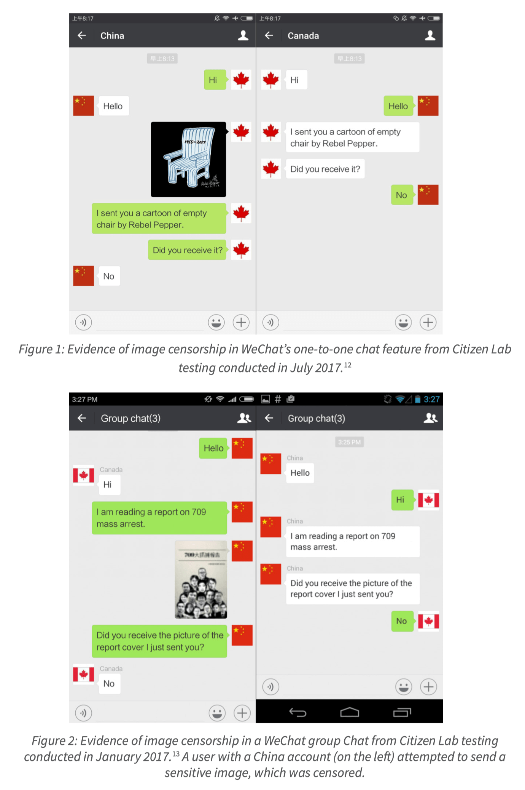
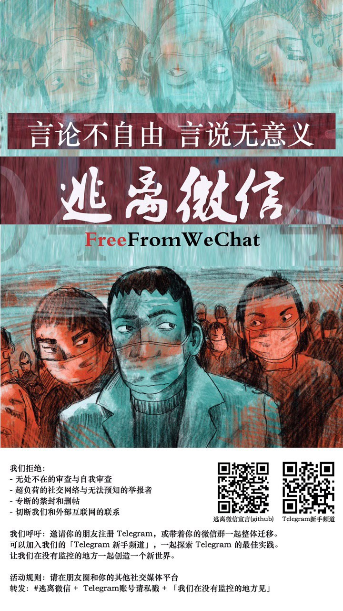

<h1>人生苦短，远离微信</h1>

 

收集微信的反人性设计、无耻审查行为、侵犯用户隐私、监控聊天记录、试图控制人民生活等侵犯 [人权](https://www.un.org/zh/about-us/universal-declaration-of-human-rights) 的行径，期望用户认识到微信的弊病，并提供微信之外的选择，倡导用户用脚投票、拒绝使用微信 👎️。

🤖️ 欢迎提交 [Issues](https://github.com/TomBener/get-rid-of-wechat/issues) 和 [Pull requests](https://github.com/TomBener/get-rid-of-wechat/pulls)
 

---

> 方便真的是我们人生的唯一价值吗？所谓精神生活并不是指向专家学习审美或是艺术创作，那其实是把精神生活变成了世俗生活。微信越是一种生活方式，我们就越有必要对其严阵以待。—— [李如一](https://blog.yitianshijie.net/2020/08/10/wechat-as-lifestyle)

> 在网络管制如此之严厉的内地，似乎也只有微信能保证一贯的通畅和高速。但更深层的原因恐怕是长时间被剥夺选择权带来的思维懒惰：既然只要打开微信就可以社交、阅读、消费，我为什么还要花时间去外面的世界一个个找呢？ —— [PlatyHsu](https://type.cyhsu.xyz/2015/10/understand-wechat-the-hard-way/)

> 没有人知道变化是怎么发生的，但是当有人意识到这种变化似乎是个问题的时候，所有的挽救措施都已经来不及了。请勿寄希望于对方做出改变，自由只能通过自己争取而来。

> The goal of public policy everywhere should be to increase access to the internet – the whole goddam internet, not some corporate-controlled alcove – for as many people as possible. By condoning zero-rating we will condemn to a lifetime of servitude as one of Master Zuckerberg’s sharecroppers. We can, and should, do better than that. —— [John Naughton](https://www.theguardian.com/technology/2015/jan/11/internet-access-developing-nations-facebook-domination)
> 
> ---
> 
> 无论在哪里，公共政策的目标都应当是增加互联网的接入 —— 完完整整的互联网、而不是被某些巨头控制的壁龛 —— 的访问率，使之尽可能惠及更多的人。接受零费率，就意味着被迫一辈子委身为扎克伯格的农奴。我们可以、而且应当做得更好。

> 哪怕问问朋友「要不我们试试别的聊天软件」，也绝不是没有意义。大部分人不会问，所以问了就是改变的开始。当面问，问亲人、同事、同学。午休用餐时问，放学回家路上问。认真但温和地问，严肃但非对抗性地讨论。不要害怕她们觉得妳很奇怪。永远都会有人觉得妳奇怪，但永远也都有人和妳有同样的信念。—— [李如一](https://blog.yitianshijie.net/2021/06/24/how-to-fight-giants)

<h2>目录</h2>

- [公开报道](#公开报道)
- [用户不满](#用户不满)
- [学术研究](#学术研究)
- [微信之外的选择](#微信之外的选择)
  - [即时通讯](#即时通讯)
  - [远程协作 / 群组讨论](#远程协作--群组讨论)
  - [信息获取](#信息获取)
  - [移动支付](#移动支付)
- [推荐阅读](#推荐阅读)
- [相关项目](#相关项目)

---

## 公开报道

| 📅 日期 | 📖️ 标题 | 🤖️ 来源 | 💾️ 备份 |
| :--------: | :--------: | :--------: | :--------: |
| 2017-04-13 | China’s WeChat censoring ‘sensitive’ photos, not just text, study shows | [South China Morning Post](https://www.scmp.com/news/china/article/2087363/chinas-wechat-censoring-your-sensitive-photos-not-just-text-study-shows) | [Internet Archive](https://web.archive.org/web/20210220070001/https://www.scmp.com/news/china/article/2087363/chinas-wechat-censoring-your-sensitive-photos-not-just-text-study-shows) |
| 2018-01-01 | 李书福炮轰微信侵犯隐私 | [圈内新知](https://www.sohu.com/a/214207636_99957087)、[YouTube](https://www.youtube.com/watch?v=F6x--qBscHM) |[Internet Archive](https://web.archive.org/web/20180104094303/https://www.sohu.com/a/214207636_99957087) |
| 2018-09-21 | 为何我选择不依赖微信生活 | [纽约时报中文网](https://cn.nytimes.com/opinion/20180921/learning-to-survive-without-wechat/zh-hant/) | [Internet Archive](https://web.archive.org/web/20191210131756/https://cn.nytimes.com/opinion/20180921/learning-to-survive-without-wechat/zh-hant/) |
| 2019-07-15 | How WeChat censors private conversations, automatically in real time | [MIT Technology Review](https://www.technologyreview.com/2019/07/15/134178/how-wechat-censors-private-conversations-automatically-in-real-time/) | [Internet Archive](https://web.archive.org/web/20210208101525/https://www.technologyreview.com/2019/07/15/134178/how-wechat-censors-private-conversations-automatically-in-real-time/) |
| 2020-06-19 | 逃离微信 | [端传媒](https://theinitium.com/article/20200619-technology-escape-from-wechat) | [Telegraph](https://telegra.ph/逃离微信端传媒-Initium-Media-06-19) |
| 2020-08-27 | How WeChat Censored the Coronavirus Pandemic | [WIRED](https://www.wired.com/story/wechat-chinese-internet-censorship-coronavirus/) | [Internet Archive](https://web.archive.org/web/20210119095340/https://www.wired.com/story/wechat-chinese-internet-censorship-coronavirus/) |
| 2020-12-22 | WeChat Becomes a Powerful Surveillance Tool Everywhere in China | [The Wall Street Journal](https://www.wsj.com/articles/wechat-becomes-a-powerful-surveillance-tool-everywhere-in-china-11608633003) | [Archive.today](https://archive.ph/jtHVs) |
| 2021-01-24 | 继 QQ 读用户浏览器之后，一边说保护用户隐私要做输入法，一边读取用户浏览器的微信 | [V2EX](https://www.v2ex.com/t/747692) | [Archive.today](https://archive.vn/2jQay) |
| 2021-01-25 | 贵州一女子因在微信群中骂社区支书「草包支书」，被毕节警方跨市铐走行拘 | [东方今报](http://news.jinbw.com.cn/newsdetail/12143047) | [竹新社](https://t.me/s/tnews365/10935)、[Archive.today](https://archive.vn/wip/YT24p) |
| 2021-02-03 | 深圳南山法院一审判决认定：微信好友关系不属于用户隐私 | [人民法治](https://news.ifeng.com/c/83Yvtvi3iQR) | [竹新社](https://t.me/s/tnews365/11104)、[Archive.today](https://archive.vn/dX2Gv) |
| 2021-02-06 | 马化腾：每天都有超过 10 亿张照片上传，我们掌握了几乎每个中国人十几年来脸部变化 | [Twitter](https://twitter.com/ma4103/status/1357915085436448771) | [Archive.today](https://archive.vn/LP28b) |
| 2021-07-06 | 清华、北大等各大高校性少数社团公众号被全部封禁  | [端传媒](https://theinitium.com/article/20210707-morning-brief/) | [竹新社](https://t.me/s/tnews365/14605)、[Archive.today](https://archive.ph/Zn0pS) |
| 2021-11-01 | 宁夏一男子在微信群发表情包被指辱警，行政拘留 9 日 | [澎湃新闻](https://www.thepaper.cn/newsDetail_forward_15166139) | [乌鸦观察](https://t.me/s/bigcrowdev/19646)、[Archive.today](https://archive.md/mkh5u) |
| 2021-11-25 | China’s State-Run Companies Limit Use of Tencent’s Messaging App | [The Wall Street Journal](https://www.wsj.com/articles/chinas-state-run-firms-limit-use-of-tencents-messaging-app-11637837474) | [竹新社](https://t.me/s/tnews365/18690)、[Archive.today](https://archive.md/I5bH5) |

## 用户不满

| 📖️ 标题 | 🤖️ 来源 | 💾️ 备份 |
| :-----: | :----: | :----: |
| 逃离微信控制的一千个小时 | [少数派](https://sspai.com/post/37557) | [Telegraph](https://telegra.ph/逃离微信控制的一千个小时---少数派-02-04) |
| 无法理解的「拍一拍」 | [Twitter](https://twitter.com/cyanapps/status/1356439428906983427) | [Archive.today](https://archive.today/wip/36mLy) |
| 微信 = GFW | [一天世界](https://blog.yitianshijie.net/2018/02/02/wechat-equals-gfw) | [Internet Archive](https://web.archive.org/web/20201203020925/https://blog.yitianshijie.net/2018/02/02/wechat-equals-gfw) |
| 微信，是一个生活方式 | [一天世界](https://blog.yitianshijie.net/2020/08/10/wechat-as-lifestyle) |[Archive.today](http://archive.vn/eJI0b) |
| 微信做了哪些恶 | [Twitter](https://twitter.com/fak3D0nA1dT3UmP/status/1216446242131046400) | [Internet Archive](https://web.archive.org/web/20210225073106/https://twitter.com/fak3D0nA1dT3UmP/status/1216446242131046400) |
| 微信十年的产品思考 | [陈仓颉](https://imzm.im/my-thoughts-on-wechat-ten-years) | [IPFS](https://ipfs.io/ipfs/QmWx8239FEJYTmEMHNojWybWYbpsQRYs1XgYgB5bLUoQjS) |
| 微信给我推荐广场舞内容之后 | [青山绿水](https://www.huhexian.com/3766.html) | [Internet Archive](https://web.archive.org/web/20210225070506/https://www.huhexian.com/3766.html) |
| Understand WeChat The Hard Way | [Neverland](https://type.cyhsu.xyz/2015/10/understand-wechat-the-hard-way/) | [Telegraph](https://telegra.ph/Understand-WeChat-The-Hard-Way-04-16) |
| 朋友圈被微信屏蔽之后 | [TomBen](https://blog.retompi.com/post/fucking-wechat/) | [Internet Archive](https://web.archive.org/web/20210511115832/https://blog.retompi.com/post/fucking-wechat/) |
| 请停止你的张小龙行为：微信究竟还要笼罩中国人多久？ | [酷安](https://www.coolapk.com/feed/21114760?shareKey=MWUyZDRlMzI4MjkwNjA5ODk0NjQ) | [Archive.today](https://archive.ph/G860P) |
| 一篇正经讨论人口普查数据的文章，在微信公众平台被认为违规，微信上何谈公共讨论？ | [Twitter](https://twitter.com/TomBener/status/1392420093364035585) | [Archive.today](https://archive.ph/yMTe0) |
| 微信科研，Best 科研？ | [两个圈 Two Circles](https://anchor.fm/twocircles24/episodes/Vol-21--Best-etjpsn/a-a52l319) | [Internet Archive](https://web.archive.org/web/20210515125353/https://anchor.fm/twocircles24/episodes/Vol-21--Best-etjpsn/a-a52l319) |
| 在中国：TA 为什么不使用微信？ | [iYouPort](https://www.iyouport.org/在中国：ta为什么不使用微信？) | [IPFS](https://ipfs.io/ipfs/QmXDhT3zLF6dSc9nzbLmcMJczN1C1WwzEhyT3WGj4hEKMJ) |
| 微信视频号，本质上这不过是注意力商人的又一门生意 | [Twitter](https://twitter.com/Jimmy_JingLv/status/1365105701794836481) | [Internet Archive](https://web.archive.org/web/20210226010543/https://twitter.com/Jimmy_JingLv/status/1365105701794836481) |
| 如何与巨物对抗 | [一天世界](https://blog.yitianshijie.net/2021/06/24/how-to-fight-giants/) | [Internet Archive](https://web.archive.org/web/20210625175143/https://blog.yitianshijie.net/2021/06/24/how-to-fight-giants/) |
| 张小龙探亲记 | [微博@麦芽原浆](https://telegra.ph/张小龙探亲记-06-27) | [Internet Archive](https://web.archive.org/web/20210702114536/https://telegra.ph/张小龙探亲记-06-27) |
| 不用微信的人 | [人物](https://mp.weixin.qq.com/s/BcYAJ95Pub3HQKXNF8XTLw) | [Internet Archive](https://web.archive.org/web/20210811034956/https://mp.weixin.qq.com/s/BcYAJ95Pub3HQKXNF8XTLw) |
| 人生苦短，远离微信 | [Hayami](https://mp.weixin.qq.com/s/4Py6h2gklluARgWNBlPYHw) | [Internet Archive](https://web.archive.org/web/20210812144420/https://mp.weixin.qq.com/s/4Py6h2gklluARgWNBlPYHw) |
| 微信在 iOS 后台反复读取用户相册 | [ Apple Nuts](https://t.me/s/AppleNuts/1301) | [IPFS](https://ipfs.io/ipfs/QmR2osFPFBjZn1b5LR8KjphjkeEDcp9WXrdxexV72nAxKC) |

## 学术研究

| 📅 日期 | 💭️ 标题 | ✍️ 作者 |
| :------: | :-----: | :------: |
| 2020-05-07 | [We Chat, They Watch: How International Users Unwittingly Build up WeChat’s Chinese Censorship Apparatus](https://citizenlab.ca/2020/05/we-chat-they-watch) | Jeffrey Knockel, Christopher Parsons, Lotus Ruan, Ruohan Xiong, Jedidiah Crandall, and Ron Deibert |

| 📅 日期 | 💭️ 标题 | ✍️ 作者 |
| :------: | :-----: | :------: |
| 2021-10-04 | [Censorship in the Semi-Private Domain: A Theory of Cross-Domain Variation and Evidence from WeChat](https://doi.org/10.1080/10670564.2021.1985839) | Elliot Ji, Zack Bowersox |

## 微信之外的选择

### 即时通讯

- [iMessage](https://support.apple.com/zh-cn/explore/messages)：苹果设备
  - [iMessage 使用介绍 - 爱范儿](https://www.ifanr.com/app/1418693)
- [Telegram](https://telegram.org)：强烈推荐
  - [Telegram：新手指南、使用教程及频道推荐（持续更新中）- 庭说](https://tingtalk.me/telegram)
- [Signal](https://signal.org)
- [Keybase](https://keybase.io)

### 远程协作 / 群组讨论

- [Slack](https://slack.com)
- [Discord](https://discord.com)
- [飞书](https://www.feishu.cn)
  - [Lark](https://www.larksuite.com)（飞书海外版）

### 信息获取

- [RSS](https://en.wikipedia.org/wiki/RSS)
  - [ALL about RSS](https://github.com/AboutRSS/ALL-about-RSS)：A list of RSS related stuff: tools, services, communities and tutorials, etc.
  - [RSSHub](https://docs.rsshub.app): 🍰 万物皆可 RSS
  - [RSSerpent](https://github.com/RSSerpent/RSSerpent)：帮助你使用 RSS 订阅那些不支持 RSS 订阅的网站
  - [RSS Source](https://rss-source.com/)：2021 年 RSS 订阅源推荐
  - [Feeddd](https://feeddd.org) - 免费的微信公众号 RSS
  - [#RSS - 少数派](https://sspai.com/tag/RSS)
- [Newsletter](https://en.wikipedia.org/wiki/Newsletter)
  - [把你的邮箱调教成最好的新闻阅读器](https://newslab2020.github.io/Collection/媒体食谱/%5B新闻实验室%5D%20-%202017-05-10%20把你的邮箱调教成最好的新闻阅读器｜媒体食谱07.html)
  - [中文 Newsletter 导航](https://www.notion.so/Newsletter-68ee46c0a4574f659fb8a873ead438c6)
  - [Hedwig](https://hedwig.pub): 一个简单可靠的邮件 Newsletter 创作平台
  - [InboxReads](https://inboxreads.co): Find The Best Email Newsletters For Any Topic
  - [Substack](https://substack.com): A place for independent writing. Subscribe directly to writers you trust
  - [Readsom](https://readsom.com): Discover content you’ll want to read
  - [Thanks for Subscribing](https://thanksforsubscribing.app): Discover the finest selection of indie newsletters around the web
  - [The Sample](https://thesample.ai): Add some variety to your information diet

### 移动支付

- 现金：拒收现金违反《[中华人民共和国人民币管理条例](http://www.gov.cn/gongbao/content/2019/content_5468922.htm)》
- 借记卡
- 信用卡
- [云闪付](https://yunshanfu.unionpay.com)：微信支付、支付宝支付与银联云闪付 App 实现 [互认互扫](https://web.archive.org/web/20211002064105/https://finance.sina.com.cn/tech/2021-09-26/doc-iktzscyx6466353.shtml)
- [支付宝](https://www.alipay.com)
- [数字人民币](https://zh.wikipedia.org/zh-cn/数字人民币)
- [Apple Pay](https://www.apple.com.cn/apple-pay/)
- [PayPal](https://www.paypal.com)

## 推荐阅读

- [无所隐瞒论 - 维基百科](https://zh.wikipedia.org/wiki/无所隐瞒论)
- [Right to privacy — Can online communication be private? - Medium](https://mohammad-shavez.medium.com/right-to-privacy-can-online-communication-be-private-d825f659a60c)
- [Are you free on the Internet? - Medium](https://mohammad-shavez.medium.com/are-you-free-on-the-internet-8fa7ea71a2bb)
- [The Right to Privacy - Harvard Law Review](https://louisville.edu/law/library/special-collections/the-louis-d.-brandeis-collection/the-right-to-privacy)
- [Why Privacy Matters - TED](https://youtu.be/pcSlowAhvUk)
- [Why We Should End the Data Economy - Reboot](https://thereboot.com/why-we-should-end-the-data-economy)

## 相关项目

- [逃离微信宣言](https://github.com/FreeFromGFW/FreeFromWechat)

